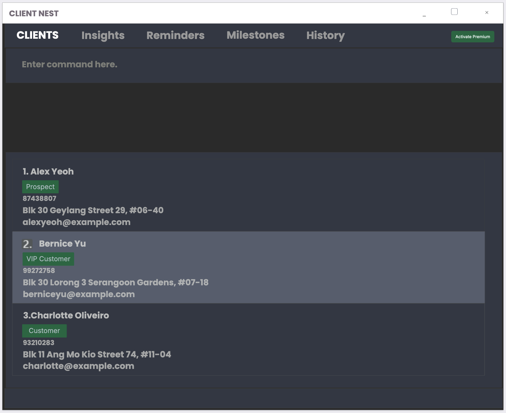

# ClientNest

## Overview
ClientNest is a desktop application designed to help young financial advisors manage client interactions more
effectively. It provides an organized and structured approach to client relationship management, ensuring that
important follow-ups and milestones are never missed.

### Target Users
ClientNest is specifically designed for **young financial advisors**, such as new undergraduate or graduate financial
associates (FAs), who are looking to streamline their client management process.

### Value Proposition
Many young financial advisors struggle with handling a large volume of client interactions. Keeping track of numerous
touchpoints manually can be overwhelming, leading to missed follow-ups and weaker client relationships. **ClientNest**
offers a solution by:
- Organizing client data efficiently
- Providing reminders for key follow-ups
- Enhancing trust through better client engagement
- Allowing FAs to focus on growing their business

### Features
- Contact management: Store and organize client details efficiently
- Follow-up reminders: Never miss an important client milestone
- Interaction history tracking: Keep a log of all client touch-points
- User-friendly UI: Simple and intuitive for young professionals

## Getting Started
To set up ClientNest on your system, follow these steps:
1. Ensure you have Java 17 installed
2. Download the latest release from [GitHub](https://github.com/AY2425S2-CS2103-F10-2/tp/releases)
3. Run `java -jar clientnest.jar`

---

#### Acknowledgements
This project is based on the [AddressBook-Level3](https://se-education.org/addressbook-level3) project created by the
[SE-EDU initiative](https://se-education.org). It has been adapted to meet the specific needs of financial advisors.

For more details, refer to our **[ClientNest Product Website](https://github.com/AY2425S2-CS2103-F10-2/tp)**.
