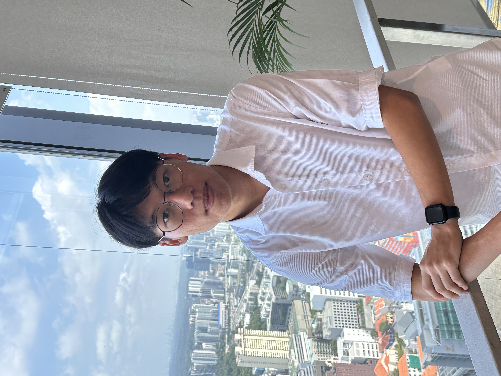
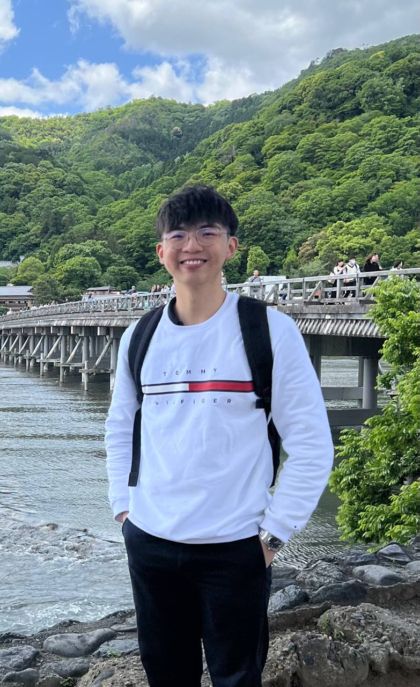
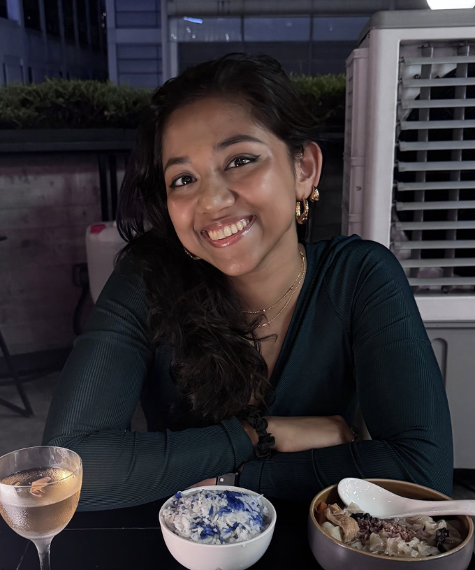

# About Us

We are a team based in the [School of Computing, National University of Singapore](http://www.comp.nus.edu.sg).

You can reach us at the email `seer[at]comp.nus.edu.sg`

## Project team

### Fabian Heng

[[github](http://github.com/FabianHeng)]
[[portfolio](team/fabianheng.md)]

* Role: Developer
* Responsibilities: UI

### Lee De En

[[github](http://github.com/leedeen01)] 
[[portfolio](team/leedeen01.md)]

* Role: Developer
* Responsibilities: Data

### Teesha Basak 

[[github](http://github.com/teesha902)]
[[portfolio](team/teesha902.md)]

* Role: Developer
* Responsibilities: Documentation

### Nithvin Leelakrishnan

[[github](http://github.com/nightlyaffair)]
[[portfolio](team/nightlyaffair.md)]

* Role: Developer
* Responsibilities: Scheduling and tracking
